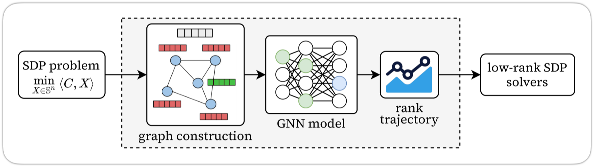
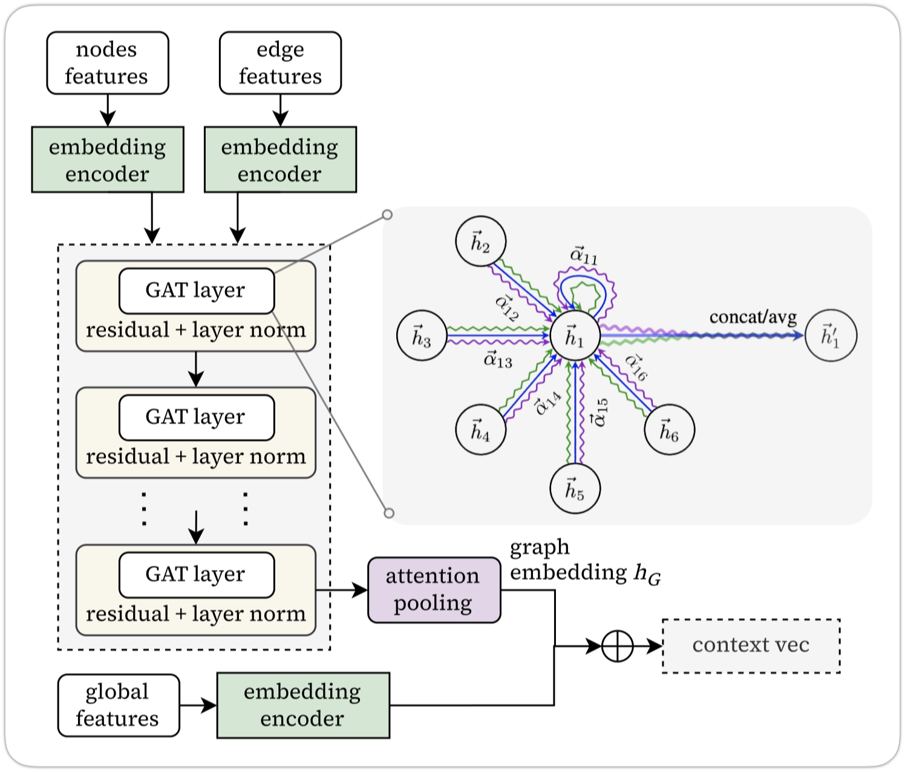
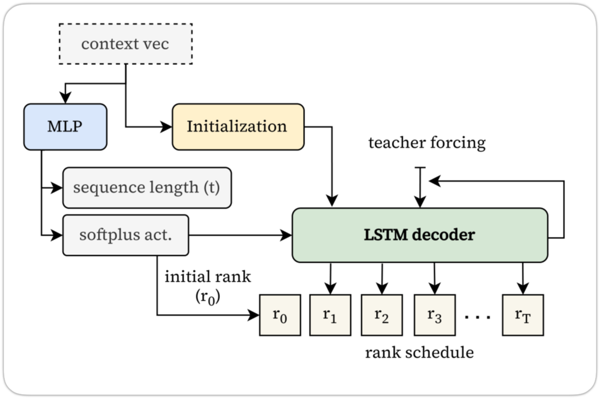

# Learning to Rank for Low-Rank SDP Solvers

Semidefinite programming (SDP) is a powerful framework from convex optimization with applications across machine learning, control theory, and combinatorial optimization. Recent low-rank methods like LoRADS and HaLLAR achieve scalability by exploiting the Burer-Monteiro factorization and are able to solve problems with millions of variables in minutes. However, these methods rely on hand-crafted heuristics for rank selection which happens to be a key hyperparameter that fundamentally determines solver performance. We introduce a graph neural network approach that learns to predict optimal rank trajectories directly from problem structure. In our approach, SDPs are represented as constraint graphs and using graph attention networks with LSTM-based rank trajectory prediction, our method eliminates expensive trial-and-error rank adjustments. Experimental results on MaxCut, SDPLIB, and Mittelmann benchmarks demonstrate speedups of up to $3\times$ on large-scale problems, with the model learning interpretable structure-to-rank mappings across various problem classes.

<p align="center">
  
</p>

## Project structure

```bash
.
├── benchmark/         # benchmark problem instances
├── lorads/            # LoRADS solver source code
├── hallar/            # hallar solver binaries (no source code)
├── dataset/
│   ├── proc/          # processed PyG graph data (.pt)
│   └── instances/     # raw SDPA problem instances (.dat-s)
│   └── sol_json/      # ground truth solution trajectories (.json)
│   ├── loader.py      # PyG Dataset class and data loading utilities
│   └── processor.py   # converts SDPA (.dat-s) files to PyG graph data (.pt)
├── model/
│   ├── layers.py      # GNN layers, MLP blocks, and attention mechanisms
│   └── net.py         # main architecture
├── benchmark.py       # script to compare predicted schedules vs. vanilla LoRADS
├── train.py           # main training loop
├── infer.py           # inference script for generating rank schedules
├── tune.py            # hyperparameter optimization using Optuna
└── pyproject.toml     # project dependencies and configuration
```

## Installation

To install the dependencies using `uv`, run:
```bash
uv sync
```

Alternatively, you can use `uv pip` to install directly into your current environment:
```bash
uv pip install -r pyproject.toml
```

## Resources and setup

To run the benchmarks and inference scripts, you must download the necessary assets.

Download benchmark files, problem instances, compiled LoRADS binaries, and trained checkpoints from the [RELEASE](https://github.com/muhd-umer/ltr-lowrank-sdp/releases/tag/files) page.

Ensure the LoRADS binary is executable and placed correctly for `benchmark.py` to find it (default path: `./lorads/src/build/LoRADS_v_2_0_1-alpha`)

## Usage

### Data processing

The model operates on graph representations of SDP instances. To convert standard SDPA sparse format files (`.dat-s`) into PyG data objects (`.pt`):
```bash
python -m dataset.processor --input "path/to/<file_name>.dat-s" --output "path/to/<file_name>.pt"
```

The processor extracts:
- *Node features.* Spectral properties (eigenvalues), sparsity patterns, and norms of constraint matrices
- *Edge features.* Coupling strength between constraints (Frobenius inner products)
- *Global features.* Problem scale, density, and block structure

### Training

To train the model, you need a dataset of processed graphs (`dataset/proc/`) and their corresponding ground truth solution trajectories (`dataset/sol_json/`). Example training command:
```bash
python train.py \
    --data-root dataset \
    --epochs 150 \
    --batch-size 16 \
    --hidden-dim 128 \
    --gnn-layers 4 \
    --lr 5e-4 \
    --log-dir logs/exp1 \
    ...
```

### Hyperparameter tuning

To optimize model architecture and loss weights using Optuna:

```bash
python tune.py --trials 50 --epochs 80 --param-budget 600000
```

### Inference

To predict a rank schedule for a specific instance using a trained checkpoint:
```bash
python infer.py --checkpoint "path/to/model.pt" --input "dataset/proc/<file_name>.pt"
```

To run batch inference on the test set and calculate metrics:
```bash
python infer.py --checkpoint "path/to/model.pt" --batch --output "results.json"
```

### Benchmarking

To benchmark the speedup against the vanilla LoRADS solver:

1. Ensure the LoRADS executable is built and located at `./lorads/src/build/LoRADS_v_2_0_1-alpha` (or update the path in `benchmark.py`)
2. Run the benchmark script:
    ```bash
    # run specific instance
    python benchmark.py --subtype gset --instance G1 --checkpoint logs/best_model.pt

    # run all instances in a subtype
    python benchmark.py --subtype sdplib --all-instances
    ```

The script will; **a)** predict the rank schedule using the GNN model, **b)** run LoRADS with the predicted schedule, **c)** run LoRADS with default heuristics, and **d)** compare solve times and objective values.

## Methodology

### Architecture
- **Encoder.** A GATv2 (graph attention network) based encoder processes the constraint graph. It utilizes attention pooling to aggregate node embeddings into a global context vector
- **Decoder.** An LSTM-based sequence decoder takes the graph embedding and autoregressively predicts the rank schedule $\{r_0, r_1, \dots, r_T\}$ and the schedule length $T$

<p align="center">
  
  
</p>

### Loss function
The model is trained using a multi-objective loss:
- *Schedule loss.* Masked Log-MSE to handle scale invariance
- *Length loss.* Cross-entropy for schedule length classification
- *Monotonicity penalty.* Enforces non-decreasing rank schedules
- *Under-estimation penalty.* Heavily penalizes predicting ranks lower than the oracle, as this causes solver failure

## License

This project is released under the MIT License; see [LICENSE](LICENSE) for details.